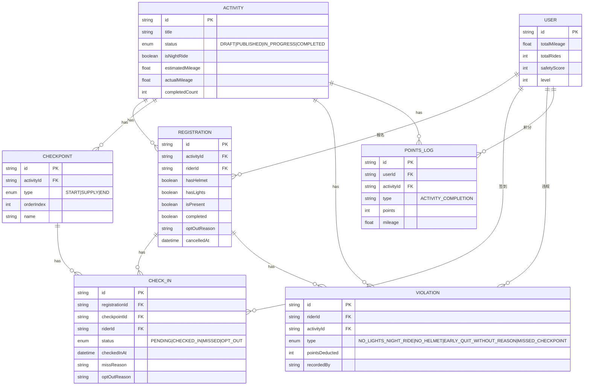
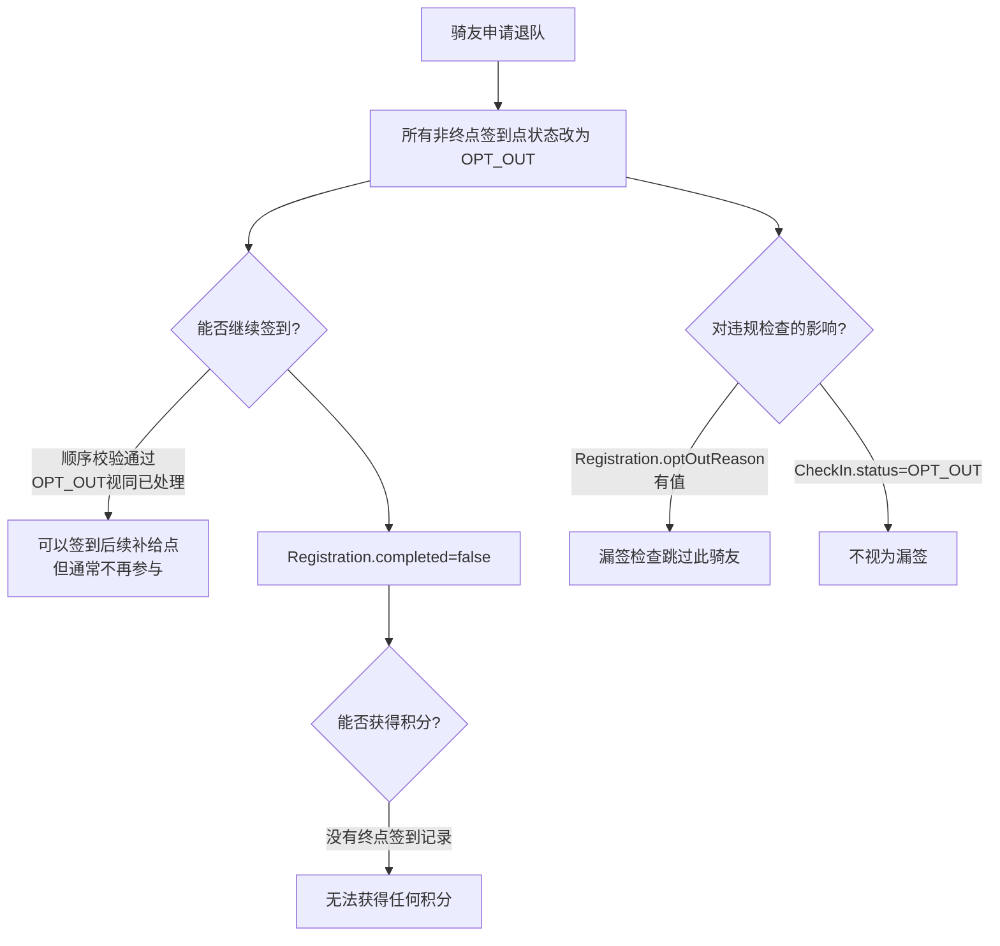
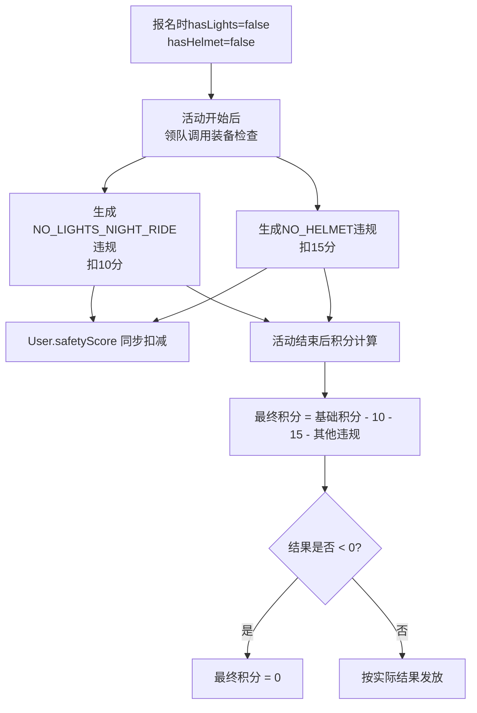

# 骑行活动数据流说明文档

> 本文档描述骑友从报名到完赛积分到账的完整数据流转链路，重点说明各环节之间的相互影响，供运营同事排查问题使用。

## 一、核心数据模型关联图



## 二、完整数据流图

```mermaid
flowchart TD
    classDef stage fill:#e1f5fe,stroke:#01579b,stroke-width:2px
    classDef action fill:#fff3e0,stroke:#e65100,stroke-width:2px
    classDef decision fill:#f3e5f5,stroke:#4a148c,stroke-width:2px
    classDef data fill:#e8f5e9,stroke:#1b5e20,stroke-width:2px
    classDef negative fill:#ffebee,stroke:#b71c1c,stroke-width:2px

    A[活动创建<br/>DRAFT]:::stage --> B[活动发布<br/>PUBLISHED]:::stage
    B --> C[骑友报名<br/>填写装备信息]:::action

    subgraph 报名阶段
        C:::action --> D[生成Registration记录<br/>hasHelmet/hasLights]:::data
        D --> E{报名人数满?}:::decision
        E -->|是| F[报名失败]:::negative
        E -->|否| G[报名成功]:::data
    end

    G --> H[活动开始<br/>IN_PROGRESS]:::stage

    subgraph 签到与违规
        H:::stage --> I[出发签到<br/>START]:::action
        I --> J{已签到?}:::decision
        J -->|是| K[Registration.isPresent=true<br/>CheckIn=CHECKED_IN]:::data
        J -->|否| L[CheckIn=MISSED]:::negative

        K --> M[补给点签到<br/>SUPPLY]:::action
        M --> N{顺序签到?<br/>前一站已签?}:::decision
        N -->|否| O[签到失败<br/>需先完成前一站]:::negative
        N -->|是| P[CheckIn=CHECKED_IN]:::data

        P --> Q{需要退队?}:::decision
        Q -->|是| R[申请退队<br/>填写原因]:::action
        R --> S[所有非终点CheckIn=OPT_OUT<br/>Registration.completed=false<br/>Registration.optOutReason=原因]:::data
        S --> T[退队流程结束<br/>无积分]:::negative

        P --> U[终点签到<br/>END]:::action
        U --> V[Registration.completed=true<br/>CheckIn=CHECKED_IN]:::data
    end

    subgraph 违规检查
        H --> W[夜骑装备检查]:::action
        W --> X{hasLights?}:::decision
        X -->|否| Y[生成违规:NO_LIGHTS_NIGHT_RIDE<br/>扣10分<br/>safetyScore-10]:::negative
        W --> Z{hasHelmet?}:::decision
        Z -->|否| AA[生成违规:NO_HELMET<br/>扣15分<br/>safetyScore-15]:::negative

        V --> AB[活动结束后<br/>漏签自动检查]:::action
        AB --> AC{CheckIn=MISSED/PENDING<br/>且无正当理由?}:::decision
        AC -->|是| AD[生成违规:MISSED_CHECKPOINT<br/>扣3分/个]:::negative
    end

    subgraph 积分计算
        AC -->|否| AE[活动结束<br/>COMPLETED]:::stage
        Y & AA & AD --> AE
        AE --> AF[计算积分]:::action

        AF --> AG[基础积分 = floor(里程)]:::data
        AG --> AH[全勤奖励: 所有签到+10]:::data
        AH --> AI[难度加成: ADVANCED+15 EXPERT+30]:::data
        AI --> AJ[违规扣减: Σviolations.pointsDeducted]:::negative
        AJ --> AK[最终积分 = max(0, 基础+奖励-扣减)]:::data

        AK --> AL[生成PointsLog记录]:::data
        AL --> AM[更新User.totalMileage]:::data
        AM --> AN[更新User.totalRides+1]:::data
        AN --> AO[更新User.level(按里程)]:::data
        AO --> AP[积分到账完成]:::data
    end
```

## 三、各环节详细说明

### 3.1 报名阶段

**核心代码**: [registrations.service.ts](file:///Users/huangding/Documents/SOLOCODE%203/0619/mbp/zj-00396-rideclub-4/src/registrations/registrations.service.ts#L26-L110)

**关键数据**:
- `hasHelmet`: 报名时勾选是否佩戴头盔（默认 true）
- `hasLights`: 报名时勾选是否携带车灯（默认 true）
- 这两个字段直接影响后续夜骑装备违规检查

**注意事项**:
- 只有活动状态为 `PUBLISHED` 时才能报名
- 已取消报名的可以重新报名（`cancelledAt` 有值时走更新逻辑）
- 活动开始后（`IN_PROGRESS`）不能取消报名

### 3.2 出发签到

**触发方式有两种**:

1. **领队标记到场** - [registrations.service.ts > markPresence](file:///Users/huangding/Documents/SOLOCODE%203/0619/mbp/zj-00396-rideclub-4/src/registrations/registrations.service.ts#L295-L383)
   ```
   POST /registrations/:id/presence
   Body: { isPresent: true/false }
   ```

2. **骑友自行签到** - [check-ins.service.ts > checkIn](file:///Users/huangding/Documents/SOLOCODE%203/0619/mbp/zj-00396-rideclub-4/src/check-ins/check-ins.service.ts#L24-L136)
   ```
   POST /check-ins/checkpoint/:checkpointId
   ```

**数据变化**:
- `Registration.isPresent = true`
- `CheckIn.status = CHECKED_IN`（对应 START 签到点）
- `CheckIn.checkedInAt = 当前时间`

### 3.3 补给点签到

**核心代码**: [check-ins.service.ts > checkIn](file:///Users/huangding/Documents/SOLOCODE%203/0619/mbp/zj-00396-rideclub-4/src/check-ins/check-ins.service.ts#L66-L81)

**顺序强制校验**:
```javascript
const previousCheckpoints = checkpoints.filter(cp => cp.orderIndex < current.orderIndex);
for (const prevCp of previousCheckpoints) {
  const prevCheckIn = registration.checkIns.find(ci => ci.checkpointId === prevCp.id);
  if (!prevCheckIn || (prevCheckIn.status !== CHECKED_IN && prevCheckIn.status !== OPT_OUT)) {
    throw new BadRequestException(`请先完成前一个签到点：${prevCp.name}`);
  }
}
```

**关键点**:
- 前一个签到点必须是 `CHECKED_IN` 或 `OPT_OUT` 状态才能签当前点
- 漏签后可以由领队修改状态为 `MISSED` 并填写原因
- `MISSED` 且有原因的不会自动生成违规记录

### 3.4 退队（Opt Out）

**核心代码**: [registrations.service.ts > optOut](file:///Users/huangding/Documents/SOLOCODE%203/0619/mbp/zj-00396-rideclub-4/src/registrations/registrations.service.ts#L234-L293)

**触发条件**:
- 活动状态必须为 `IN_PROGRESS`
- 只能操作自己的报名

**数据变化（批量更新）**:
- 所有非终点（type !== END）签到点的 `CheckIn.status = OPT_OUT`
- `CheckIn.optOutReason = 退队原因`
- `Registration.optOutReason = 退队原因`
- `Registration.completed = false`

**对积分的影响**:
- 退队后无法完成终点签到
- `Registration.completed = false`，积分计算时会被跳过（没有 END 签到记录）
- 如果退队无正当理由，领队可手动记录 `EARLY_QUIT_WITHOUT_REASON` 违规（扣5分）

### 3.5 夜骑装备违规检查

**核心代码**: [violations.service.ts > checkNightRideEquipment](file:///Users/huangding/Documents/SOLOCODE%203/0619/mbp/zj-00396-rideclub-4/src/violations/violations.service.ts#L196-L283)

**触发时机**: 活动开始后，领队调用检查接口
```
POST /violations/activity/:activityId/check-equipment
```

**违规类型与扣分**:

| 违规类型 | 检查字段 | 扣分 | 对应 ViolationType |
|---------|---------|------|-------------------|
| 夜骑未携带车灯 | `Registration.hasLights = false` | 10分 | `NO_LIGHTS_NIGHT_RIDE` |
| 未佩戴头盔 | `Registration.hasHelmet = false` | 15分 | `NO_HELMET` |

**数据变化**:
- 生成 `Violation` 记录，`pointsDeducted` 为对应分值
- 同步扣减 `User.safetyScore -= pointsDeducted`
- 积分计算时会从基础积分中扣减这些分值

**注意**: 只会对 `activity.isNightRide = true` 的活动进行车灯检查

### 3.6 漏签自动违规记录

**核心代码**: [violations.service.ts > autoRecordMissedCheckpoints](file:///Users/huangding/Documents/SOLOCODE%203/0619/mbp/zj-00396-rideclub-4/src/violations/violations.service.ts#L285-L409)

**触发时机**: 活动结束后，领队调用漏签检查接口

**判定逻辑**:
```
CheckIn 状态为 MISSED 且 missReason 为空 → 生成违规（扣3分）
CheckIn 状态为 PENDING（完全没处理） → 生成违规（扣3分）
CheckIn 状态为 MISSED 且有 missReason → 豁免，不生成违规
CheckIn 状态为 OPT_OUT → 跳过（退队已处理）
Registration 有 optOutReason → 跳过整个骑友
```

### 3.7 终点签到与完赛

**核心代码**: [check-ins.service.ts > checkIn](file:///Users/huangding/Documents/SOLOCODE%203/0619/mbp/zj-00396-rideclub-4/src/check-ins/check-ins.service.ts#L121-L126)

**数据变化**:
- `CheckIn.status = CHECKED_IN`（对应 END 签到点）
- `Registration.completed = true`

### 3.8 活动结束

**核心代码**: [activities.service.ts > finish](file:///Users/huangding/Documents/SOLOCODE%203/0619/mbp/zj-00396-rideclub-4/src/activities/activities.service.ts#L367-L417)

**数据变化**:
- `Activity.status = COMPLETED`
- `Activity.actualEndTime = 当前时间`
- `Activity.actualMileage = 实际里程（可选）`
- `Activity.completedCount = 完赛人数统计`

### 3.9 积分计算与发放

**核心代码**: [points.service.ts > calculateAndDistributePoints](file:///Users/huangding/Documents/SOLOCODE%203/0619/mbp/zj-00396-rideclub-4/src/points/points.service.ts#L9-L117)

**积分计算公式**:

```
最终积分 = max(0, 基础积分 + 全勤奖励 + 难度加成 - 违规扣减)
```

**各项计算规则**:

| 项目 | 计算方式 | 说明 |
|-----|---------|------|
| 基础积分 | `floor(actualMileage \|\| estimatedMileage)` | 里程向下取整 |
| 全勤奖励 | +10 | 所有签到点均为 CHECKED_IN 状态 |
| 难度加成 | ADVANCED: +15<br/>EXPERT: +30 | 根据 Activity.routeLevel |
| 违规扣减 | `- Σ(violations.pointsDeducted)` | 该活动下所有违规记录的扣分之和 |

**前置条件（缺一不可）**:
1. 有 START 签到点的 `CHECKED_IN` 记录
2. 有 END 签到点的 `CHECKED_IN` 记录

**数据更新**:
- 生成 `PointsLog` 记录，`type = "ACTIVITY_COMPLETION"`
- `User.totalMileage += 本次里程`
- `User.totalRides += 1`
- `User.level = 按累计里程重新计算`（见下方等级表）

**用户等级规则**: [points.service.ts > calculateLevel](file:///Users/huangding/Documents/SOLOCODE%203/0619/mbp/zj-00396-rideclub-4/src/points/points.service.ts#L212-L223)

| 累计里程 | 等级 |
|---------|------|
| < 50 km | 1 |
| 50 - 99 km | 2 |
| 100 - 199 km | 3 |
| 200 - 499 km | 4 |
| 500 - 999 km | 5 |
| 1000 - 1999 km | 6 |
| 2000 - 2999 km | 7 |
| 3000 - 4999 km | 8 |
| 5000 - 9999 km | 9 |
| ≥ 10000 km | 10 |

## 四、各环节相互影响关系

### 4.1 退队对后续环节的影响



**关键结论**:
- 退队后**无法获得本次活动的任何积分**（因为无法完成终点签到）
- 退队后**不会被记录漏签违规**（漏签检查会跳过有 `optOutReason` 的骑友）
- 退队前已被记录的装备违规**仍然有效**，会影响该骑友的 `safetyScore`

### 4.2 夜骑装备违规对积分的影响



**关键结论**:
- 装备违规扣分**直接从积分中扣除**，且最低为0分
- 装备违规扣分**同时影响 safetyScore**，与积分是两套独立体系
- 即使骑友退队，已记录的装备违规仍然会扣减 `safetyScore`

### 4.3 签到状态对积分的影响

| 签到点状态 | 能否继续签到 | 全勤奖励 | 完赛判定 | 漏签违规 |
|-----------|-------------|---------|---------|---------|
| CHECKED_IN | ✅ 可以 | ✅ 算入 | ✅ 需START+END | ❌ 不会 |
| OPT_OUT | ✅ 可以 | ❌ 不算 | ❌ 无 | ❌ 不会 |
| MISSED（有原因） | ✅ 可以 | ❌ 不算 | ❌ 无 | ❌ 不会 |
| MISSED（无原因） | ❌ 不可以 | ❌ 不算 | ❌ 无 | ✅ 扣3分 |
| PENDING | ❌ 不可以 | ❌ 不算 | ❌ 无 | ✅ 扣3分 |

## 五、常见问题排查指引

### 5.1 骑友反映积分未到账

**排查步骤**:

1. 检查 `Registration.completed` 是否为 `true`
   ```sql
   SELECT completed, optOutReason, cancelledAt
   FROM Registration
   WHERE activityId = ? AND riderId = ?
   ```

2. 检查是否有 START 和 END 签到点的 `CHECKED_IN` 记录
   ```sql
   SELECT cp.type, ci.status, ci.checkedInAt
   FROM CheckIn ci
   JOIN Checkpoint cp ON ci.checkpointId = cp.id
   WHERE ci.registrationId = ?
   ORDER BY cp.orderIndex
   ```

3. 检查活动状态是否为 `COMPLETED`
   ```sql
   SELECT status FROM Activity WHERE id = ?
   ```

4. 检查是否已执行 `calculateAndDistributePoints`
   ```sql
   SELECT * FROM PointsLog
   WHERE userId = ? AND activityId = ? AND type = 'ACTIVITY_COMPLETION'
   ```

### 5.2 骑友反映被错误扣分

**排查步骤**:

1. 查看该活动下的违规记录
   ```sql
   SELECT type, pointsDeducted, description, recordedAt, recordedBy
   FROM Violation
   WHERE activityId = ? AND riderId = ?
   ```

2. 对于 `NO_LIGHTS_NIGHT_RIDE` / `NO_HELMET`：
   - 检查报名时的 `hasLights` / `hasHelmet` 字段值
   - 检查活动 `isNightRide` 是否为 `true`（车灯检查仅限夜骑）

3. 对于 `MISSED_CHECKPOINT`：
   - 检查对应 `CheckIn` 的 `missReason` 是否有值
   - 检查 `Registration.optOutReason` 是否有值（退队应豁免）

4. 积分计算详情：
   ```
   最终积分 = max(0, floor(里程) + 全勤奖励 + 难度加成 - Σ违规扣分)
   ```

### 5.3 签到失败排查

**常见原因**:

1. **"请先完成前一个签到点"**
   - 前一个签到点状态不是 `CHECKED_IN` 也不是 `OPT_OUT`
   - 解决：先签前一个点，或由领队将前一个点改为 `OPT_OUT` / `MISSED`（有原因）

2. **"活动未开始或已结束"**
   - 活动状态不是 `IN_PROGRESS`
   - 解决：确认活动是否已开始/已结束

3. **"您未报名此活动"**
   - 没有报名记录或报名已取消
   - 解决：检查 `Registration.cancelledAt` 是否有值

## 六、违规扣分速查表

| 违规类型 | 代码常量 | 扣分 | 触发方式 | 影响字段 |
|---------|---------|------|---------|---------|
| 夜骑未带车灯 | `NO_LIGHTS_NIGHT_RIDE` | 10 | 领队调用装备检查 | safetyScore, 积分 |
| 未佩戴头盔 | `NO_HELMET` | 15 | 领队调用装备检查 | safetyScore, 积分 |
| 无故退队 | `EARLY_QUIT_WITHOUT_REASON` | 5 | 领队手动记录 | safetyScore, 积分 |
| 漏签（无原因） | `MISSED_CHECKPOINT` | 3/个 | 自动漏签检查 | safetyScore, 积分 |

---

**文档版本**: v1.0
**最后更新**: 2026-06-21
**代码版本**: 对应当前仓库 master 分支
